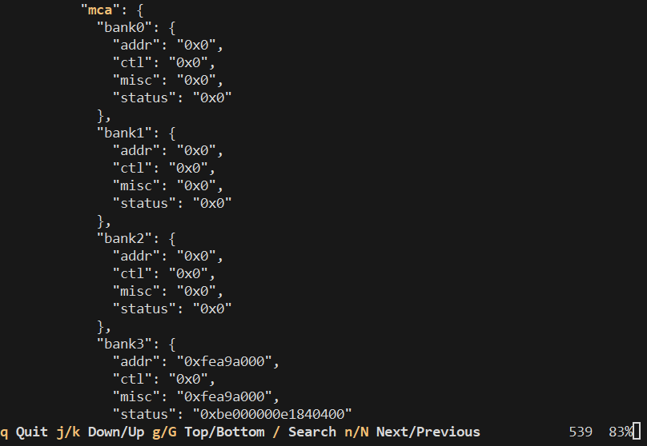

# Lightweight Crash Log Framework - EFI Application

The Crash Log EFI application enables in-band extraction of Intel Crash Log
records from the ACPI Boot Error Record Table (BERT). The extracted records are
saved on an EFI System Partition, typically stored on a USB flash drive, for
later retrieval and analysis. Additionally, the application can decode the
extracted records and display the crash data on the UEFI console.



## Getting Started

1. **Prepare the USB Flash Drive:**

   - Create a FAT32 partition on a USB flash drive.
   - Copy the `iclg.efi` in this partition.

2. **Boot to EFI Shell:**

   - Insert the USB flash drive into the platform under test.
   - Boot the system to the EFI shell.

3. **Access the USB Flash Drive:**

   Change the working directory to the file system of the USB flash drive:

   ```
       Shell:\> FS1:
       FS1:\> ls
       Directory of: FS1:\
       01/08/2025  16:54             330,240  iclg.efi
       ...
   ```

4. **Explore EFI Extraction Options:**
  
   Learn about the different options available for EFI extraction:

   ```
       FS1:\> iclg.efi -h
   ```

5. **Extract the Crash Log:**

  Extract the Crash Log from the ACPI BERT and save it to the partition:

   ```
       FS1:\> iclg.efi extract sample.crashlog
       FS1:\> ls
       ...
       01/08/2025  16:55               3,504  sample.crashlog
   ```

6. **Decode the Crash Log:**

   Decode the Crash Log sample:
   
   ```
       FS1:\> iclg.efi decode sample.crashlog
   ```

## Building and Testing

1. **Build the Application in Release Mode:**

   ```
   $ cargo build --release
   ```

2. **Run the UEFI Application in QEMU:**

   ```
   $ uefi-run target/x86_64-unknown-uefi/release/iclg.efi \
       -f ../lib/tests/samples/three_strike_timeout.crashlog \
       -- --nographic
   ```

## Development

Before submitting pull requests that modify any files in this directory, please
format the code according to style guidelines using the following commands:

```
$ cargo fmt
$ cargo clippy
```
